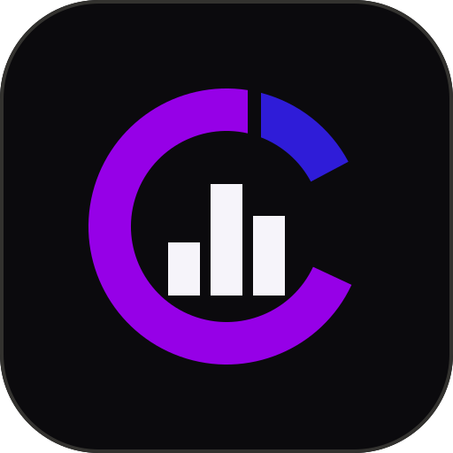

<p align="center">
  
</p>

<h1 align="center">CoverScope</h1>

<p align="center">
  A cross-platform, local-first .NET code coverage explorer with clear metrics,
  source highlighting, test-failure insights, and Cobertura support.
</p>

> [!NOTE]
> CoverScope is currently in early beta. The core coverage workflow is functional, but packaging, history, comparisons, and editor integrations are still evolving.

## Why CoverScope?

Coverage data is useful only when it is easy to navigate and understand. CoverScope separates coverage collection from visualization, providing a focused standalone workspace without depending on an IDE extension.

It can run coverage for a solution or test project through Coverlet, import existing Cobertura reports, merge reports from multiple test projects, and connect coverage gaps directly to annotated source code.

## Features

- Solution-wide line, branch, and method coverage metrics
- Project → namespace → class metrics drill-down
- Project → namespace → source file → class → method explorer
- Covered, partially covered, and uncovered source-line highlighting
- Covered, missed, and total line counts
- Sorting by coverage percentage, missed lines, size, or name
- Filters for coverage gaps, thresholds, minimum size, and text
- Automatic merging of reports from multiple test projects
- Partial-class aggregation across source files
- Structured failed-test results with exceptions, stack traces, output, and source locations
- Coverage results remain available when tests fail but collection succeeds
- Persistent Coverlet exclusions for assemblies, files, attributes, and auto-properties
- Cross-platform solution and project browser
- Local-first operation with no required external service

## Requirements

- [.NET 10 SDK](https://dotnet.microsoft.com/download/dotnet/10.0)
- [`coverlet.collector`](https://github.com/coverlet-coverage/coverlet) in test projects when running new coverage collections

Recent .NET test templates commonly include Coverlet. Otherwise, add it to each test project:

```bash
dotnet add path/to/Tests.csproj package coverlet.collector
```

## Install from GitHub Packages

The `DD3.CoverScope.Tool` package is currently published to the private
CoverScope GitHub Packages registry. Create a GitHub personal access token
(classic) with `read:packages` and access to this private repository. Keep the
token outside the repository.

Add the package source once:

```bash
dotnet nuget add source https://nuget.pkg.github.com/diogod3/index.json \
  --name github-diogod3 \
  --username YOUR_GITHUB_USERNAME \
  --password YOUR_GITHUB_PACKAGES_TOKEN \
  --store-password-in-clear-text
```

> [!CAUTION]
> `--store-password-in-clear-text` writes the credential to your user-level
> NuGet configuration. Omit that option where your platform's NuGet credential
> provider can store the token securely. Never place a token in this repository
> or a committed `NuGet.Config`.

Install the tool:

```bash
dotnet tool install --global DD3.CoverScope.Tool \
  --version 0.1.0-beta.1 \
  --add-source https://nuget.pkg.github.com/diogod3/index.json
```

Update to a newer published version:

```bash
dotnet tool update --global DD3.CoverScope.Tool \
  --add-source https://nuget.pkg.github.com/diogod3/index.json
```

Uninstall it:

```bash
dotnet tool uninstall --global DD3.CoverScope.Tool
```

## Usage

Start CoverScope from the directory containing the code you want to inspect:

```bash
coverscope
```

CoverScope binds only to `127.0.0.1` on an available port, then prints and
opens the friendlier `http://coverscope.localhost:<port>` address. It also prints
`http://127.0.0.1:<port>` as a fallback and runs until you press Ctrl+C. Neither
address requires hosts-file changes, administrator privileges, or a DNS service.
The solution browser starts in the directory where the command was invoked.

You can preselect a solution or project and control browser and port behavior:

```bash
coverscope MySolution.sln
coverscope tests/MyProject.Tests.csproj --no-browser
coverscope MySolution.sln --port 5073
coverscope --help
coverscope --version
```

## Development

Clone the repository:

```bash
git clone https://github.com/diogod3/CoverScope.git
cd CoverScope
```

Restore and run:

```bash
dotnet restore DD3.CoverScope.sln
dotnet run --project src/DD3.CoverScope.Web/DD3.CoverScope.Web.csproj
```

Alternatively, open `DD3.CoverScope.sln` in Visual Studio and start `DD3.CoverScope.Web`.

Open the local URL printed by the application.

## Running coverage

1. Select the current target in the command bar.
2. Browse to a `.sln`, `.slnx`, or test-project file.
3. Configure optional collection exclusions.
4. Select **Run coverage**.

CoverScope runs the equivalent of:

```bash
dotnet test --collect:"XPlat Code Coverage"
```

Generated reports are stored beside the selected target under `coverage-output/`. This directory is ignored by Git.

If tests fail, CoverScope presents the failed tests separately from infrastructure or collection errors. When a usable coverage report was still produced, it remains available with a visible failed-run warning.

## Opening an existing report

1. Select **Open report**.
2. Choose a Cobertura XML file or enter its local path.
3. Provide a source root if the report paths cannot be resolved automatically.

## Running the tests

```bash
dotnet test DD3.CoverScope.sln
```

Build and inspect the tool package:

```bash
dotnet pack src/DD3.CoverScope.Web/DD3.CoverScope.Web.csproj --configuration Release
pwsh ./scripts/Inspect-Package.ps1 -PackagePath ./artifacts/packages/DD3.CoverScope.Tool.0.1.0-beta.1.nupkg
pwsh ./scripts/Smoke-Test.ps1 -PackagePath ./artifacts/packages/DD3.CoverScope.Tool.0.1.0-beta.1.nupkg
```

## Maintainer release process

Pull requests build, test, pack, inspect, and smoke-test the tool on Windows,
Linux, and macOS. CI never publishes packages.

To prepare a release:

1. Update `Version` in
   `src/DD3.CoverScope.Web/DD3.CoverScope.Web.csproj`.
2. Commit the version change using Conventional Commits, for example
   `chore(release): prepare v0.1.0-beta.2`.
3. Merge the validated pull request into `main`.
4. Create and push an annotated `v*` tag whose value exactly matches the
   project version with a leading `v`.

```bash
git tag -a v0.1.0-beta.1 -m "v0.1.0-beta.1"
git push origin v0.1.0-beta.1
```

The release workflow validates the tag against the project version, runs the
full verification, publishes to GitHub Packages with `GITHUB_TOKEN`, uploads
the `.nupkg` as a workflow artifact, and creates a prerelease GitHub Release
containing the package. Do not create a release tag until the corresponding
version is ready to publish.

## Repository structure

- `src/DD3.CoverScope.Web` — Blazor application, coverage services, and static assets
- `tests/DD3.CoverScope.Tests` — parser, merger, settings, filesystem, metrics, and TRX tests
- `scripts` — package inspection and installed-tool smoke tests
- `.github/workflows` — cross-platform CI and tag-triggered package release
- `DD3.CoverScope.sln` — solution entry point
- `global.json` — .NET 10 SDK selection policy

## Data and privacy

CoverScope runs locally. Solution paths, source files, coverage reports, and test output are not sent to an external service by the application.

Collection settings are stored under the current user's local application-data directory. Imported reports are copied to a CoverScope application-data folder for local processing.

## Roadmap

TBD

## Development disclosure

CoverScope was developed with the assistance of OpenAI's GPT-5.6 Sol through Codex. Project direction, requirements, review, testing, and release decisions remain human-led.

## License

CoverScope is licensed under the [Apache License 2.0](LICENSE).
